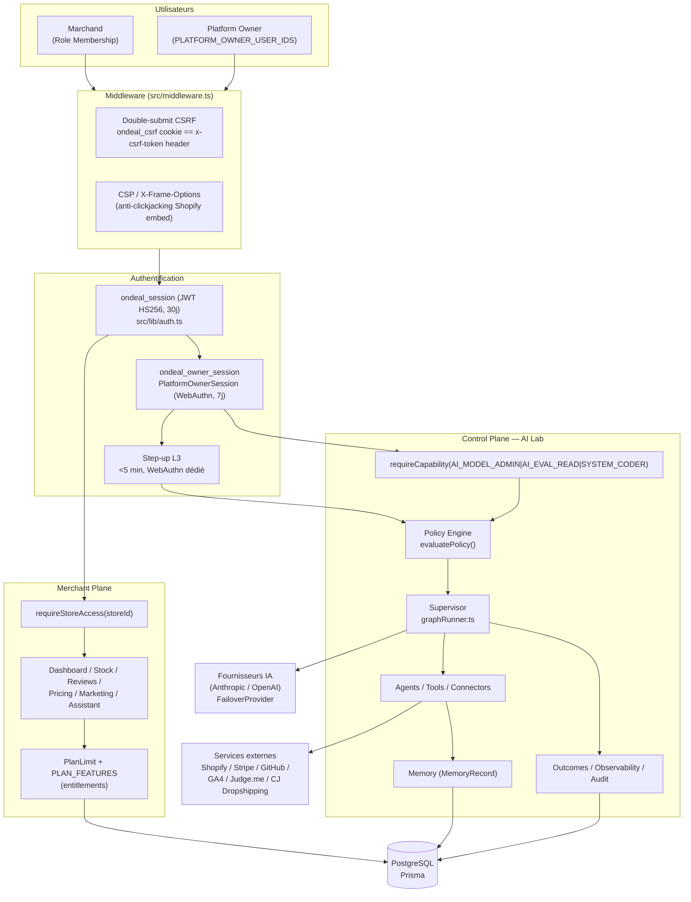

# 01 — Architecture technique complète

Stack : Next.js 16 (App Router, Turbopack), TypeScript strict, Prisma ORM sur PostgreSQL, Vitest, ESLint. Déployé sur Vercel (`intelligence.ondeal.fr`). 89 routes API sous `src/app/api/`, 68 modèles Prisma dans `prisma/schema.prisma`.

## Vue d'ensemble — deux plans distincts, jamais mélangés

Le principe fondateur, imposé server-side depuis PHASE 2 et jamais contourné (grep confirmé) : **"STORE ADMIN ≠ ONDEAL OWNER"**.

- **Merchant Plane** : un marchand (`Role.OWNER/ADMIN/ANALYST/VIEWER` d'une `Organization`) gère sa boutique — dashboard, stock, avis, pricing, marketing. Gate : `requireStoreAccess`/`requireRole` (`src/lib/auth.ts`).
- **Control Plane** : le Platform Owner (OnDeal lui-même) administre l'AI Lab — Model Router, agents, missions, connecteurs, évolution du système. Gate : `isPlatformOwner()` (allowlist `PLATFORM_OWNER_USER_IDS`), jamais un rôle Membership, quel qu'il soit.

## Flux d'une requête mutative (frontière de sécurité exacte)

1. `src/middleware.ts` intercepte toute méthode `POST/PUT/PATCH/DELETE` sous `/api/*` non exemptée (`CSRF_EXEMPT_PREFIXES` : `/api/auth/login`, `/api/auth/signup`, `/api/auth/logout`, `/api/webhooks/`, `/api/shopify/callback`, `/api/shopify/install`, `/api/shopify/session-token-exchange`, `/api/cron/`) et exige `ondeal_csrf` (cookie) === `x-csrf-token` (header) — 403 sinon.
2. La route lit la session (`getCurrentUser()` ou `getSession()`), 401 si absente.
3. Merchant Plane : `requireStoreAccess(storeId)` vérifie une `Membership` réelle en base pour l'organisation propriétaire du `storeId` — jamais une confiance dans le `storeId` fourni par le client seul.
4. Control Plane : `requireCapability` (allowlist) → éventuellement `requireCapabilityWithOwnerSession` (+ session WebAuthn vivante) → éventuellement `requireCapabilityWithStepUp` (+ré-élévation <5 min) selon la sensibilité de l'action.
5. Toute action de l'AI Lab passe en plus par `evaluatePolicy()` (kill switch, budget, environnement SANDBOX/PRODUCTION, niveau d'autonomie) avant exécution.

## Bases de données et persistance

Un seul PostgreSQL (Prisma), schéma unique. Isolation Merchant Plane : chaque requête de donnée boutique est re-scopée par `storeId` vérifié (jamais seulement passé en paramètre — voir 09-DATA-MEMORY-PRIVACY.md §A2). Isolation Control Plane : les tables AI Lab (`StorefrontMission`, `MemoryRecord`, `AiLabAuditLog`, etc.) portent un `storeId` optionnel mais ne sont jamais lues/écrites via une route Merchant Plane.

Fichiers d'attachement AI Lab : stockés sur disque (`/tmp/ondeal-ai-lab-attachments`, éphémère conteneur), jamais dans un stockage objet persistant — limite documentée en 09.

## Fournisseurs IA et fallback

`src/lib/ai/models/router.ts` — `chooseModel`/`resolveFailoverCandidates`, modèle par défaut `claude-haiku-4-5-20251001` (Anthropic). `FailoverProvider` bascule vers un candidat de secours en cas d'échec provider — sauf en mode Experiment, qui désactive volontairement le failover pour mesurer la configuration exacte demandée (voir 02-AI-LAB-ARCHITECTURE.md §8).

## Services externes et dépendances

| Service | Usage | Fichier |
|---|---|---|
| Shopify Admin GraphQL API | Sync catalogue/stock/commandes, OAuth install, billing AppSubscription | `src/lib/integrations/shopify.ts`, `src/app/api/shopify/*` |
| Stripe | Billing alternatif (hors Shopify) | `src/lib/integrations/stripe-billing.ts`, `src/app/api/webhooks/stripe` |
| GitHub (PAT Owner) | Connecteur Control Plane — lecture dépôt, ouverture de PR réelles (System Evolution) | `src/lib/ai/connectors/github.ts` |
| Google Analytics 4 | Connecteur marchand (OAuth2, lecture seule) | `src/lib/integrations/google-analytics.ts` |
| Judge.me | Connecteur marchand (avis clients) | `src/lib/integrations/judgeme.ts` |
| CJ Dropshipping | Connecteur marchand (stock fournisseur réel) | `src/lib/integrations/cjdropshipping.ts` |
| Upstash Redis (optionnel) | Rate limiting (login WebAuthn, recovery) — repli mémoire si absent | `src/lib/rate-limit.ts` |
| Anthropic / OpenAI | Fournisseurs de modèles IA (missions, images) | `src/lib/ai/providers/*` |

## Limitations d'architecture connues

- Exécution serverless Vercel : les missions longues (coder_implementation notamment) sont bornées par le mur d'exécution — le mécanisme de pause/reprise (`PAUSED`, même `missionId`) compense, mais une mission complexe peut nécessiter plusieurs appels/relances (voir 03-AGENTIC-AUTONOMY.md).
- Aucun stockage objet (S3-like) pour les pièces jointes AI Lab — `/tmp` conteneur uniquement.
- Un seul environnement Postgres de référence en local pour la validation ; production sur Vercel Postgres/Neon (non ré-vérifié indépendamment dans ce dossier au-delà de `/api/health`).
